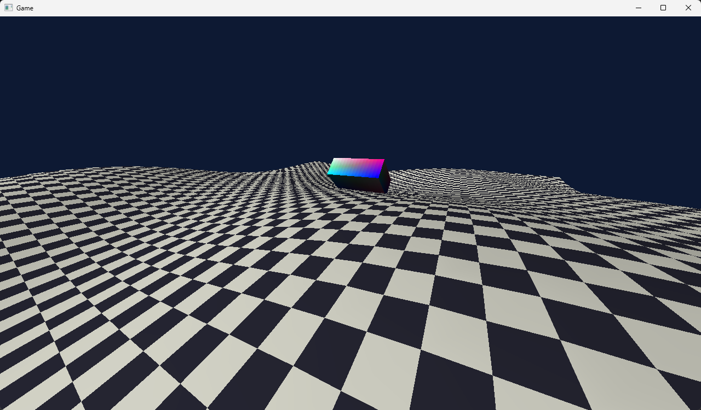

# Rubin Engine
Modular and agnostic game engine/framework that is self-contained and empowers the user with the freedom to create and modify.

## Premise
While powerful game engines do exist, they usually lack the simplicity that made games fun to play, easy to modify and light to run. Rubin Engine is a project that aims to provide both a high-level and a low-level interface for developers to create their games, while keeping everything abstracted and modular so people can easily extend the engine and replace every little aspect of it for a custom-made implementation if they may.

## Implemented features
- [x] Windowing
- [x] 3D Renderer
- [x] Resource creation
- [x] Basic keyboard and mouse input
- [x] Logging
- [x] Low-level interface
- [x] Windows and OpenGL implementations

## Planned features
- [ ] High-level interface with automatic entity and scene management systems
- [ ] Multithreading
- [ ] Modern PBR materials
- [ ] Text rendering
- [ ] File I/O
- [ ] Resource parsing (textures, meshes, etc.)
- [ ] Physics system
- [ ] Modern input system
- [ ] Networking
- [ ] Audio

## Requirements
Currently supported:

- Windows x64
- OpenGL 4.6
- C++20
- Visual Studio 2026

Additional platforms and graphics APIs can be added by implementing the public interfaces.

## Structure
The root is a Visual Studio 2026 solution containing the projects **core-systems** and **app**.
* **core-systems**: The project that contains all of the engine's low-level implementations and foundation for everything that follows. It contains the windowing system, renderer, math library and so on. You can abstract it into a higher-level if you want (a high-level abstraction is officially planned).
* **app**: A sample app that demonstrates what the engine can do. It acts as a kind of sandbox and it is not guaranteed that will contain something playable or fun each commit, it is always changing.

## How to use it
### Importing
In order to develop a game with **Rubin Engine**, you first need to add [core-systems/include](core-systems/include) as an include directory in your project and link the respective library after compiling.
### Creating a window with graphics
After you successfully import the engine's headers, you can include [core-systems.h](core-systems/include/core-systems.h), call the static methods `CoreSystems::CreateWindow()` and use the resulting pointer to `IWindow` to manage the game's window (the caller is responsible for the window's memory management). After initializing the window, you can then create the graphics backend by calling `CoreSystems::CreateGraphicsBackend()` Example:

```c++
#include <core-systems.h>

int main()
{
	IWindow* window = CoreSystems::CreateWindow();

	if (not window->TryInitialize())
		return 1;

	IGraphicsBackend* graphics = CoreSystems::CreateGraphicsBackend(window);

	if (not graphics->TryInitialize())
	{
		return 2;
	}

	while (not window->ShouldClose())
	{
		graphics->MakeCurrent();
		// Rendering will be done here
		graphics->SwapBuffers();
		window->Process();
	}

	graphics->Finalize();
	window->Finalize();

	delete graphics;
	delete window;
}
```

## Screenshot
Scene rendered with Rubin Engine featuring a terrain, a rotating box and a free camera.

